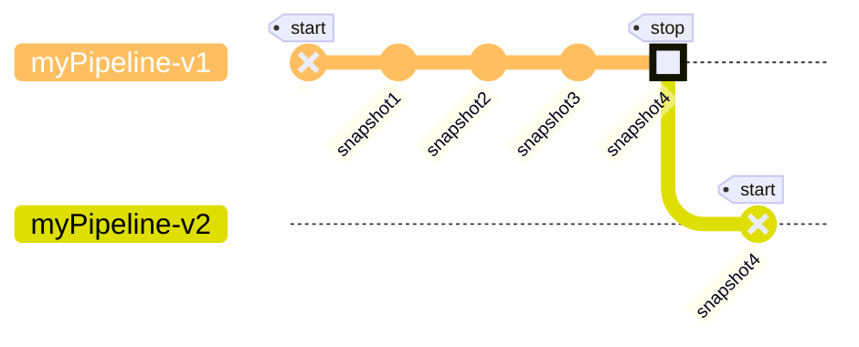

# About Mirror pipelines

<Note>
  We recently released v3 of pipeline configurations which uses a more intuitive
  and user friendly format to define and configure pipelines using a yaml file.
  For backward compatibility purposes, we will still support the previous v2
  format. This is why you will find references to each format in each yaml file
  presented across the documentation. Feel free to use whichever is more
  comfortable for you but we encourage you to start migrating to v3 format.
</Note>

## Overview

A Mirror Pipeline defines flow of data from `sources -> transforms  -> sinks`. It is configured in a `yaml` file which adheres to Goldsky's pipeline schema.

The core logic of the pipeline is defined in `sources`, `transforms` and `sinks` attributes.

* `sources` represent origin of the data into the pipeline.
* `transforms` represent data transformation/filter logic to be applied to either a source and/or transform in the pipeline.
* `sinks` represent destination for the source and/or transform data out of the pipeline.

Each `source` and `transform` has a unique name which is referenceable in other `transform` and/or `sink`, determining dataflow within the pipeline.

While the pipeline is configured in yaml, [goldsky pipeline CLI commands](/reference/cli#pipeline) are used to take actions on the pipeline such as: `start`, `stop`, `get`, `delete`, `monitor` etc.

Below is an example pipeline configuration which sources from `base.logs` Goldsky dataset, filters the data using `sql` and sinks to a `postgresql` table:

<Tabs>
  <Tab title="v3">
    ```yaml base-logs.yaml
        apiVersion: 3
        name: base-logs-pipeline
        resource_size: s
        sources:
          base.logs:
            dataset_name: base.logs
            version: 1.0.0
            type: dataset
            description: Enriched logs for events emitted from contracts. Contains the contract address, data, topics, decoded event and metadata for blocks and transactions.
            display_name: Logs
        transforms:
          filter_logs_by_block_number:
            sql: SELECT * FROM base.logs WHERE block_number > 5000
            primary_key: id
        sinks:
          postgres_base_logs:
            type: postgres
            table: base_logs
            schema: public
            secret_name: GOLDSKY_SECRET
            description: "Postgres sink for: base.logs"
            from: filter_logs_by_block_number
    ```

    <Info>
      Keys in v3 format for sources, transforms and sinks are user provided
      values. In the above example, the source reference name `base.logs`
      matches the actual dataset name. This is the convention that you'll
      typically see across examples and autogenerated configurations. However,
      you can use a custom name as the key.
    </Info>
  </Tab>

  <Tab title="v2 (deprecated)">
    ```yaml base-logs.yaml
        name: base-logs-pipeline
        resource_size: s
        apiVersion: 3
        definition:
         sources:
           - referenceName: base.logs
             type: dataset
             version: 1.0.0
         transforms: []
         sinks:
           - type: postgres
             table: base_logs
             schema: public
             secretName: GOLDSKY_SECRET
             description: 'Postgres sink for: base.logs'
             sourceStreamName: base.logs
             referenceName: postgres_base_logs
    ```
  </Tab>
</Tabs>

You can find the complete Pipeline configuration schema in the [reference](/reference/config-file/pipeline) page.

## Development workflow

Similar to the software development workflow of `edit -> compile -> run`, there's an implict iterative workflow of `configure -> apply -> monitor` for developing pipelines.

1. `configure`: Create/edit the configuration yaml file.
2. `apply`: Apply the configuration aka run the pipeline.
3. `monitor`: Monitor how the pipeline behaves. This will help create insights that'll generate ideas for the first step.

Eventually, you'll end up with a configuration that works for your use case.

Creating a Pipeline configuration from scratch is challenging. However, there are tools/guides/examples that make it easier to [get started](/mirror/create-a-pipeline).

## Understanding Pipeline Runtime Lifecycle

The `status` attribute represents the desired status of the pipeline and is provided by the user. Applicable values are:

* `ACTIVE` means the user wants to start the pipeline.
* `INACTIVE` means the user wants to stop the pipeline.
* `PAUSED` means the user wants to save-progress made by the pipeline so far and stop it.

A pipeline with status `ACTIVE` has a runtime status as well. Runtime represents the execution of the pipeline. Applicable runtime status values are:

* `STARTING` means the pipeline is being setup.
* `RUNNING` means the pipeline has been setup and is processing records.
* `FAILING` means the pipeline has encountered errors that prevents it from running successfully.
* `TERMINATED` means the pipeline has failed and the execution has been terminated.

There are several [goldsky pipeline CLI commands](/reference/config-file/pipeline#pipeline-runtime-commands) that help with pipeline execution.

For now, let's see how these states play out on successful and unsuccessful scenarios.

### Successful pipeline lifecycle

In this scenario the pipeline is succesfully setup and processing data without encountering any issues.
We consider the pipeline to be in a healthy state which translates into the following statuses:

* Desired `status` in the pipeline configuration is `ACTIVE`
* Runtime Status goes from `STARTING` to `RUNNING`

<div style={{display: 'flex', justifyContent: 'center'}}>
  ```mermaid
  stateDiagram-v2
      state ACTIVE {
        [*] --> STARTING
        STARTING --> RUNNING
      }
  ```
</div>

Let's look at a simple example below where we configure a pipeline that consumes Logs from Base chain and streams them into a Postgres database:

<Tabs>
  <Tab title="v3">
    ```yaml base-logs.yaml
        name: base-logs-pipeline
        resource_size: s
        apiVersion: 3
        sources:
         base.logs:
           dataset_name: base.logs
           version: 1.0.0
           type: dataset
           description: Enriched logs for events emitted from contracts. Contains the contract address, data, topics, decoded event and metadata for blocks and transactions.
           display_name: Logs
        transforms: {}
        sinks:
         postgres_base_logs:
           type: postgres
           table: base_logs
           schema: public
           secret_name: GOLDSKY_SECRET
           description: "Postgres sink for: base.logs"
           from: base.logs
    ```
  </Tab>

  <Tab title="v2 (deprecated)">
    ```yaml base-logs.yaml
        name: base-logs-pipeline
        definition:
         sources:
           - referenceName: base.logs
             type: dataset
             version: 1.0.0
         transforms: []
         sinks:
           - type: postgres
             table: base_logs
             schema: public
             secretName: GOLDSKY_SECRET
             description: 'Postgres sink for: base.logs'
             sourceStreamName: base.logs
             referenceName: postgres_base_logs
    ```
  </Tab>
</Tabs>

Let's attempt to run it using the command `goldsky pipeline apply base-logs.yaml --status ACTIVE` or `goldsky pipeline start base-logs.yaml`

```
❯ goldsky pipeline apply base-logs.yaml --status ACTIVE
│
◇  Successfully validated config file
│
◇  Successfully applied config to pipeline: base-logs-pipeline

To monitor the status of your pipeline:

Using the CLI: `goldsky pipeline monitor base-logs-pipeline`
Using the dashboard: https://app.goldsky.com/dashboard/pipelines/stream/base-logs-pipeline/1
```

At this point we have set the desired status to `ACTIVE`. We can confirm this using `goldsky pipeline list`:

```
❯ goldsky pipeline list
✔ Listing pipelines
────────────────────────────────────────
│ Name                          │ Version │ Status │ Resource │
│                               │         │        │ Size     │
│───────────────────────────────────────
│ base-logs-pipeline            │ 1       │ ACTIVE │ s        │
────────────────────────────────────────

```

We can then check the runtime status of this pipeline using the `goldsky pipeline monitor base-logs-pipeline` command:


We can see how the pipeline starts in `STARTING` status and becomes `RUNNING` as it starts processing data successfully into our Postgres sink.
This pipeline will start processing the historical data of the source dataset, reach its edge and continue streaming data in real time until we either stop it or it encounters error(s) that interrupts it's execution.

### Unsuccessful pipeline lifecycle

Let's now consider the scenario where the pipeline encounters errors during its lifetime and ends up failing.

There can be multitude of reasons for a pipeline to encounter errors such as:

* secrets not being correctly configured
* sink availability issues
* policy rules on the sink preventing the pipeline from writing records
* resource size incompatiblity
* and many more

These failure scenarios prevents a pipeline from getting-into or staying-in a `RUNNING` runtime status.

<div style={{display: 'flex', justifyContent: 'center'}}>
  ```mermaid
  ---
  title: Healthy pipeline becomes unhealthy
  ---
  stateDiagram-v2
      state status:ACTIVE {
        [*] --> STARTING
        STARTING --> RUNNING
        RUNNING --> FAILING
        FAILING --> TERMINATED
      }
  ```

  ```mermaid
  ---
  title: Pipeline cannot start
  ---
  stateDiagram-v2
      state status:ACTIVE {
        [*] --> STARTING
        STARTING --> FAILING
        FAILING --> TERMINATED
      }
  ```
</div>

A Pipeline can be in an `ACTIVE` desired status but a `TERMINATED` runtime status in scenarios that lead to terminal failure.

Let's see an example where we'll use the same configuration as above but set a `secret_name` that does not exist.

<Tabs>
  <Tab title="v3">
    ```yaml bad-base-logs.yaml
        name: bad-base-logs-pipeline
        resource_size: s
        apiVersion: 3
        sources:
         base.logs:
           dataset_name: base.logs
           version: 1.0.0
           type: dataset
           description: Enriched logs for events emitted from contracts. Contains the contract address, data, topics, decoded event and metadata for blocks and transactions.
           display_name: Logs
        transforms: {}
        sinks:
         postgres_base_logs:
           type: postgres
           table: base_logs
           schema: public
           secret_name: YOUR_DATABASE_SECRET
           description: "Postgres sink for: base.logs"
           from: base.logs
    ```
  </Tab>

  <Tab title="v2 (deprecated)">
    ```yaml bad-base-logs.yaml
        name: bad-base-logs-pipeline
        definition:
         sources:
           - referenceName: base.logs
             type: dataset
             version: 1.0.0
         transforms: []
         sinks:
           - type: postgres
             table: base_logs
             schema: public
             secretName: YOUR_DATABASE_SECRET
             description: 'Postgres sink for: base.logs'
             sourceStreamName: base.logs
             referenceName: postgres_base_logs
    ```
  </Tab>
</Tabs>

Let's start it using the command `goldsky pipeline apply bad-base-logs.yaml`.

```
❯ goldsky pipeline apply bad-base-logs.yaml
│
◇  Successfully validated config file
│
◇  Successfully applied config to pipeline: base-logs-pipeline

To monitor the status of your pipeline:

Using the CLI: `goldsky pipeline monitor bad-base-logs-pipeline`
Using the dashboard: https://app.goldsky.com/dashboard/pipelines/stream/bad-base-logs-pipeline/1
```

The pipeline configuration is valid, however, the pipeline runtime will encounter error since the secret that contains credentials to communicate with the sink does not exist.

Running `goldsky pipeline monitor bad-base-logs-pipeline` we see:


As expected, the pipeline has encountered a terminal error. Please note that the desired status is still `ACTIVE` even though the pipeline runtime status is `TERMINATED`

```
❯ goldsky pipeline list
✔ Listing pipelines
─────────────────────────────────────────
│ Name                          │ Version │ Status   │ Resource │
│                               │         │          │ Size     │
─────────────────────────────────────────
│ bad-base-logs-pipeline        │ 1       │ ACTIVE   │ s        │
─────────────────────────────────────────
```

## Runtime visibility

Pipeline runtime visibility is an important part of the pipeline development workflow. Mirror pipelines expose:

1. Runtime status and error messages
2. Logs emitted by the pipeline
3. Metrics on `Records received`, which counts all the records the pipeline has received from source(s) and, `Records written` which counts all records the pipeline has written to sink(s).
4. [Email notifications](/mirror/about-pipeline#email-notifications)

Runtime status, error messages and metrics can be seen via two methods:

1. Pipeline dashboard at `https://app.goldsky.com/dashboard/pipelines/stream/<pipeline_name>/<version>`
2. `goldsky pipeline monitor <name_or_path_to_config_file>` CLI command

Logs can only be seen in the pipeline dashboard.

Mirror attempts to surface appropriate and actionable error message and status for users, however, there is always room for imporovements. Please [reachout](/getting-support) if you think the experience can be improved.

### Email notifications

If a pipeline fails terminally the project members will get notified via an email.


You can configure this nofication in the [Notifications section](https://app.goldsky.com/dashboard/settings#notifications) of your project

## Error handling

There are two broad categories of errors.

**Pipeline configuration schema error**

This means the schema of the pipeline configuration is not valid. These errors are usually caught before pipeline execution. Some possible scenarios:

* a required attribute is missing
* transform SQL has syntax errors
* pipeline name is invalid

**Pipeline runtime error**

This means the pipeline encountered error during execution at runtime.

Some possible scenarios:

* credentails stored in the secret are incorrect or do not have needed access privilages
* sink availability issues
* poison-pill record that breaks the business logic in the transforms
* `resource_size` limitation

Transient errors are automatically retried as per retry-policy (for upto 6 hours) whearas non-transient ones immediately terminate the pipeline.

While many errors can be resolved by user intervention, there is a possibility of platform errors as well. Please [reachout to support](/getting-support) for investigation.

## Resource sizing

`resource_size` represents the compute (vCPUs and RAM) available to the pipeline. There are several options for pipeline sizes: `s, m, l, xl, xxl`. This attribute influences [pricing](/pricing/summary#mirror) as well.

Resource sizing depends on a few different factors such as:

* number of sources, transforms, sinks
* expected amount of data to be processed.
* transform sql involves joining multiple sources and/or transforms

Here's some general information that you can use as reference:

* A `small` resource size is usually enough in most use case: it can handle full backfill of small chain datasets and write to speeds of up to 300K records per second. For pipelines using
  subgraphs as source it can reliably handle up to 8 subgraphs.
* Larger resource sizes are usually needed when backfilling large chains or when doing large JOINS (example: JOIN between accounts and transactions datasets in Solana)
* It's recommended to always follow a defensive approach: start small and scale up if needed.

## Snapshots

A Pipeline snapshot captures a point-in-time state of a `RUNNING` pipeline allowing users to resume from it in the future.

It can be useful in various scenarios:

* evolving your `RUNNING` pipeline (eg: adding a new source, sink) without losing progress made so far.
* recover from new bug introductions where the user fix the bug and resume from an earlier snapshot to reprocess data.

Please note that snapshot only contains info about the progress made in reading the source(s) and the sql transform's state. It isn't representative of the state of the source/sink. For eg: if all data in the sink database table is deleted, resuming the pipeline from a snapshot does not recover it.

Currently, a pipeline can only be resumed from the latest available snapshot. If you need to resume from older snapshots, please [reachout to support](/getting-support)

Snapshots are closely tied to pipeline runtime in that all [commands](/reference/config-file/pipeline#pipeline-runtime-commands) that changes pipeline runtime has options to trigger a new snapshot and/or resume from the latest one.



### When are snapshots taken?

1. When updating a `RUNNING` pipeline, a snapshot is created before applying the update. This is to ensure that there's an up-to-date snapshot in case the update introduces issues.
2. When pausing a pipeline.
3. Automatically on regular intervals. For `RUNNING` pipelines in healthy state, automatic snapshots are taken every 4 hours to ensure minimal data loss in case of errors.
4. Users can request snapshot creation via the following CLI command:

* `goldsky pipeline snapshot create <name_or_path_to_config>`
* `goldsky pipeline apply <name_or_path_to_config> --from-snapshot new`
* `goldsky pipeline apply <name_or_path_to_config> --save-progress true` (CLI version \< `11.0.0`)

5. Users can list all snapshots in a pipeline via the following CLI command:

* `goldsky pipeline snapshot list <name_or_path_to_config>`

### How long does it take to create a snapshot

The amount of time it takes for a snapshot to be created depends largly on two factors. First, the amount of state accumulated during pipeline execution. Second, how fast records are being processed end-end in the pipeline.

In case of a long running snapshot that was triggered as part of an update to the pipeline, any future updates are blocked until snapshot is completed. Users do have an option to cancel the update request.

There is a scenario where the the pipeline was healthy at the time of starting the snapshot however, became unhealthy later preventing snapshot creation. Here, the pipeline will attempt to recover however, may need user intervention that involves restarting from last successful snapshot.

### Scenarios and Snapshot Behavior

Happy Scenario:

* Suppose a pipeline is at 50% progress, and an automatic snapshot is taken.
* The pipeline then progresses to 60% and is in a healthy state. If you pause the pipeline at this point, a new snapshot is taken.
* You can later start the pipeline from the 60% snapshot, ensuring continuity from the last known healthy state.

Bad Scenario:

* If the pipeline reaches 50%, and an automatic snapshot is taken.
* It then progresses to 60% but enters a bad state. Attempting to pause the pipeline in this state will fail.
* If you restart the pipeline, it will resume from the last successful snapshot at 50%, there was no snapshot created at 60%

<Snippet file="getting-help.mdx" />